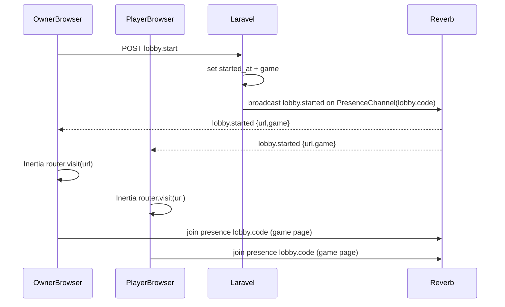

# Lobby start + game routing

## Goal

- Add a **Start** button visible to the lobby owner.
- When started, **all joined players** are navigated (Inertia) to a **game-specific route** that includes the lobby code.
- Ensure Reverb/Echo presence updates keep working by **subscribing on the game page** (reconnect is fine).
- Create the initial **game page UI**: a single-row strip of small player cards (avatar if present, nickname).
- Keep the system extensible to multiple games.

## Key decisions

- **Route shape (extensible)**: `GET /lobby/{lobby:code}/games/{game}` where `{game}` is a `GamesEnum` value.
- **Start propagation**: broadcast an event on the existing presence channel `lobby.{code}`; clients listening on the lobby page will `router.visit()` the game URL.
- **Late open behavior**: if a user opens the lobby after start, they **stay on lobby** and see a banner + a button “Перейти в игру”.
- **Auth users join flow**: authenticated users still click “Присоединиться”, but we’ll fix presence auth so they receive websocket updates and appear in lists.

## Implementation outline

### Backend

- **DB state**
  - Add columns to `lobbies` to track game start:
    - `game` (string, default `GamesEnum::DUSHNILA->value`)
    - `started_at` (timestamp nullable)
  - Files:
    - Add migration in `database/migrations/*_add_game_and_started_at_to_lobbies_table.php`

- **Presence auth for logged-in users**
  - Update [`routes/channels.php`](/home/idocky/projects/igruli/routes/channels.php) so `App\Models\User` can join `lobby.{code}` when they are a lobby member (exists `lobby_players` row for this lobby).
  - Returned member payload should match your Vue expectations: `{ id, username, team }`.

- **Lobby join for auth users (to become members)**
  - Update `LobbyController@join` in [`app/Http/Controllers/LobbyController.php`](/home/idocky/projects/igruli/app/Http/Controllers/LobbyController.php):
    - If `auth()->check()`: upsert `LobbyPlayer` with `user_id = auth()->id()`, `guest_id = (string) auth()->id()`, `username` from request, `team` from request.
    - Ensure duplicates aren’t created.
  - Update `LobbyController@show` to set `currentPlayer` for authenticated users based on `LobbyPlayer` row, not only session guest.

- **Start endpoint + broadcast**
  - Add route: `POST /lobby/{lobby:code}/start` (e.g. `lobby.start`).
  - Add controller method `LobbyController@start`:
    - Authorize with same logic as `destroyPlayer` (`canManagePlayers`).
    - Set `started_at = now()`, set `game` (for now `dushnila`).
    - Broadcast `LobbyStarted` event on `PresenceChannel('lobby.'.$code)` with `broadcastAs()` like `lobby.started` and payload including `{ game, url }`.
  - Add new event class `app/Events/LobbyStarted.php`.

- **Game page route + controller**
  - Add controller `app/Http/Controllers/LobbyGameController.php` (or `GamesController`) with `show(Lobby $lobby, string $game)`:
    - Validate `$game` in `GamesEnum::allValues()`.
    - Render the correct page: `Inertia::render('games/Dushnila', ...)` for now.
    - Provide props: `lobby` (code, title), `players` (initial list), `currentPlayer`, `game`.

### Frontend (Inertia + Vue)

- **Lobby page** ([`resources/js/pages/Lobby.vue`](/home/idocky/projects/igruli/resources/js/pages/Lobby.vue))
  - Add **Start** button (visible if `lobby.canManagePlayers`).
  - Add Echo listener for `.lobby.started`:
    - `router.visit(event.url)` for joined players.
  - If `lobby.started_at` is set, show a banner + “Перейти в игру” button linking to the game route.

- **New game page**
  - Add `resources/js/pages/games/Dushnila.vue` using [`resources/js/layouts/IgruliLayout.vue`](/home/idocky/projects/igruli/resources/js/layouts/IgruliLayout.vue).
  - UI: top strip of player mini-cards:
    - avatar if present, else initials
    - nickname
    - single row with `overflow-x-auto` for many players
  - Connect to presence channel `lobby.${code}` on mount:
    - seed from initial props
    - update live via `.here/.joining/.leaving`

- **Wayfinder routes**
  - After adding backend routes, ensure the generated TS route helpers exist for:
    - `lobby.start`
    - `lobby.games.show`
  - Use these helpers in Vue instead of hardcoded URLs.

### Tests (Pest)

- Update [`tests/Feature/LobbyTest.php`](/home/idocky/projects/igruli/tests/Feature/LobbyTest.php):
  - Auth user can join and is authorized for presence (unit-ish: channel callback returns payload) and `currentPlayer` is present in Inertia props.
  - Lobby owner can start; non-owner cannot.
  - Starting broadcasts `LobbyStarted`.

## Flow diagram

## Files to change / add

- Add: [`app/Events/LobbyStarted.php`](/home/idocky/projects/igruli/app/Events/LobbyStarted.php)
- Update: [`routes/web.php`](/home/idocky/projects/igruli/routes/web.php), [`routes/channels.php`](/home/idocky/projects/igruli/routes/channels.php)
- Update: [`app/Http/Controllers/LobbyController.php`](/home/idocky/projects/igruli/app/Http/Controllers/LobbyController.php)
- Add: [`app/Http/Controllers/LobbyGameController.php`](/home/idocky/projects/igruli/app/Http/Controllers/LobbyGameController.php)
- Add migration: `database/migrations/*_add_game_and_started_at_to_lobbies_table.php`
- Add: [`resources/js/pages/games/Dushnila.vue`](/home/idocky/projects/igruli/resources/js/pages/games/Dushnila.vue)
- Update: [`resources/js/pages/Lobby.vue`](/home/idocky/projects/igruli/resources/js/pages/Lobby.vue)
- Update tests: [`tests/Feature/LobbyTest.php`](/home/idocky/projects/igruli/tests/Feature/LobbyTest.php)